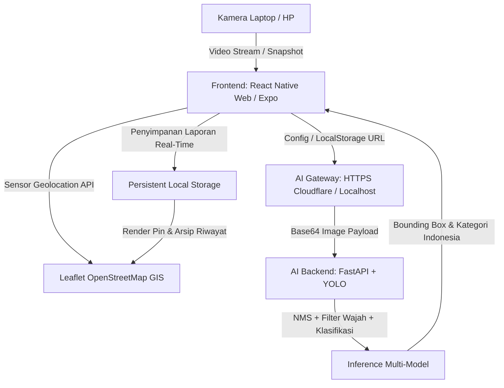

# 🌿 SpotBersih - Pantau Sampah, Bersihkan Bersama
### Smart AI-Powered Solid Waste Management & Citizen Action System

Platform web & mobile pintar berbasis **Artificial Intelligence (Computer Vision)** dan **Sistem Informasi Geografis (GIS)** untuk mendeteksi jenis sampah secara *real-time*, mengunci lokasi GPS presisi perangkat warga, dan memetakan sebaran titik sampah untuk aksi gotong royong kebersihan lingkungan.

---

## 🌐 Akses Publik & Live Deployment

- **Frontend Web App (GitHub Pages)**: [https://franswaas.github.io/spotbersih/](https://franswaas.github.io/spotbersih/)
- **Lokal Dev Server**: `http://localhost:3000` (atau via Wi-Fi lokal `http://<IP-Laptop>:3000`)
- **Backend AI Engine (FastAPI YOLO)**: Terhubung secara global melalui Cloudflare Quick Tunnel / Hugging Face Spaces.
- **URL Cloudflare Tunnel Aktif**: `https://absent-driving-someone-rural.trycloudflare.com`

---

## 📚 Technical Documentation & System Specifications

- 📘 **[Arsitektur & Spesifikasi Sistem](docs/SYSTEM_ARCHITECTURE.md)**: Rincian arsitektur frontend, backend AI YOLO, layer GIS Leaflet, alur data, dan manajemen koneksi HTTPS.
- 🧠 **[Matriks Keahlian & Rekayasa Perangkat Lunak](docs/SKILLS_AND_CAPABILITIES.md)**: Pemetaan kompetensi Computer Vision, GIS, React Native Web, dan Dynamic Networking.
- 🚀 **[Panduan Deployment Online](docs/DEPLOYMENT_GUIDE.md)**: Panduan lengkap menghubungkan smartphone, GitHub Pages, dan Cloudflare Tunnel / Hugging Face.

---

## ✨ Fitur Unggulan Sistem

### 1. 🤖 Deteksi Sampah Real-Time Berbasis AI (Computer Vision)
- **Live Cam AI Scanner**: Memindai objek sampah secara langsung dari webcam laptop atau kamera smartphone dengan animasi laser pemindai dan penanda kotak (*bounding box*) berkecepatan tinggi (<200ms).
- **Jepret / Unggah Foto**: Mengambil foto instan langsung dari rana kamera (*direct camera shutter*) atau memilih berkas dari galeri.
- **Validasi AI Ketat & Filter Wajah**: Mengeliminasi *false-positive* pada wajah/tubuh manusia dan hanya mengizinkan pengiriman laporan jika sampah valid berhasil terdeteksi.
- **Multi-Model YOLO Inference**: Mendukung model deteksi 8-kelas, 22-kelas, dan 15-kelas *underwater/denoised*.

### 2. ⚙️ Pengaturan Server AI Dinamis & Modal Status Terpadu
- **In-App AI Server Switcher**: Pengguna dapat langsung mengklik tombol status **`AI Aktif` / `AI Offline ⚙️`** di antarmuka web untuk melihat status koneksi, memilih preset Cloudflare Tunnel aktif, atau memasukkan URL backend kustom.
- **Penyimpanan Lokal Persisten**: URL tersimpan otomatis di `localStorage` browser sehingga pengguna tidak perlu melakukan *build* ulang saat URL tunnel berubah.

### 3. 🗺️ Geolokasi Hardware Murni & Peta Sebaran Interaktif
- **Pure Device GPS Sensor**: Membaca sensor GPS fisik perangkat secara langsung tanpa menggunakan tebakan provider IP yang sering meleset.
- **Pencarian Nama Jalan Otomatis**: Koordinat GPS otomatis diterjemahkan menjadi nama jalan, kelurahan, dan kecamatan via *OpenStreetMap Reverse Geocoding*.
- **Interactive Tap-to-Pin**: Pengguna dapat mengetuk (*click/tap*) titik mana saja pada peta untuk menyesuaikan dan menetapkan pin lokasi sampah secara presisi.
- **Iframe Reactive Key**: Peta Leaflet secara dinamis memusatkan tampilan ke koordinat pengguna dengan animasi denyut biru (`🔵 Posisi Anda`).

### 4. 🤝 Aksi Komunitas "Warga Bantu Warga"
- **Pantau Sebaran Titik Sampah**: Warga dapat melihat titik sampah terdekat yang dilaporkan lengkap dengan foto bukti dan jumlah sampah.
- **1-Click Bersihkan & Hapus**: Setelah sampah dibersihkan secara gotong royong, warga dapat menekan *"🧹 Tandai Bersih & Hapus"* untuk menjaga lingkungan dan memperbarui peta secara *real-time*.

### 5. 📚 Modul Edukasi Pemilahan 4 Kategori Sampah
- Katalog edukasi lengkap pemilahan: **Daur Ulang (Kuning)**, **Residu (Abu-abu)**, **Organik (Hijau)**, dan **B3 Berbahaya (Merah)** beserta tips pengelolaan lingkungan.

---

## 🛠️ Arsitektur Teknologi



- **Frontend**: React Native for Web, Expo, TypeScript, In-Memory Base64 Assets, Font Injection Engine, Dynamic Server Switcher.
- **GIS Layer**: Leaflet JS, OpenStreetMap, Nominatim Reverse Geocoding API.
- **AI Backend**: Python FastAPI, Ultralytics YOLO, OpenCV, NumPy, Uvicorn.
- **Networking**: Cloudflare Quick Tunnel (`cloudflared.exe`) untuk akses global HTTPS aman lintas jaringan seluler.

---

## 🚀 Panduan Menjalankan Sistem

### Cara Cepat (1-Click Start Windows):
Cukup klik ganda berkas **`start_spotbersih.bat`** di folder utama proyek. Skrip ini akan secara otomatis:
1. Memulai server AI FastAPI YOLO di port 8000 (`http://127.0.0.1:8000`).
2. Membuka Cloudflare Quick Tunnel untuk akses HTTPS publik (`https://xxxx.trycloudflare.com`).
3. Memulai server web frontend di port 3000 (`http://localhost:3000`).

---

### Cara Manual:

#### 1. Jalankan Backend AI YOLO:
```bash
python yolo_api_server.py
```
*(Berjalan di `http://127.0.0.1:8000`)*

#### 2. Jalankan Cloudflare Tunnel (Untuk Akses dari HP / GitHub Pages HTTPS):
```bash
.\cloudflared.exe tunnel --url http://127.0.0.1:8000
```
*(Salin URL `https://xxxx.trycloudflare.com` yang muncul di terminal).*

#### 3. Jalankan Frontend Web App:
```bash
cd app
npm run typecheck
npx expo export --platform web
python fix_paths.py
npx serve -l 3000 dist
```
Buka browser di **`http://localhost:3000`** atau akses online di **`https://franswaas.github.io/spotbersih/`**.

---

## 📱 Panduan Menghubungkan GitHub Pages ke AI Server:

1. Buka [https://franswaas.github.io/spotbersih/](https://franswaas.github.io/spotbersih/) di smartphone atau laptop.
2. Klik tombol status **`AI Offline ⚙️` / `AI Aktif`** di samping tab kamera.
3. Masukkan URL Cloudflare Tunnel aktif Anda (contoh: `https://absent-driving-someone-rural.trycloudflare.com`).
4. Klik **"Simpan & Tes Koneksi"**.
5. Status akan berubah menjadi **🟢 AI Aktif** dan pemindai langsung aktif.

---

## 📂 Struktur Repositori

```
smart-solid-waste-management/
├── app/                           # Frontend React Native Web (Expo)
│   ├── src/
│   │   ├── components/            # Komponen UI (Peta Leaflet, Tombol, dsb.)
│   │   ├── config/                # Konfigurasi Sentral AI & API (aiServer.ts)
│   │   ├── constants/             # Konstanta Aset In-Memory Base64
│   │   ├── screens/               # Layar Utama (HomeScreen, LiveScanner, Edukasi)
│   │   └── services/              # Layanan Deteksi AI & Penyimpanan Laporan
│   ├── fix_paths.py               # Otomasi Injeksi Font Base64 & Cache Busters
│   └── package.json
├── docs/                          # Dokumentasi Teknis Lengkap
│   ├── SYSTEM_ARCHITECTURE.md     # Spesifikasi Arsitektur Sistem
│   ├── SKILLS_AND_CAPABILITIES.md # Matriks Keahlian & Rekayasa
│   └── DEPLOYMENT_GUIDE.md        # Panduan Deployment Cloud & GitHub
├── hf_space/                      # Konfigurasi Docker Hugging Face Spaces
├── ml_models/                     # Bobot Model YOLO Deteksi Sampah
├── yolo_api_server.py             # Server FastAPI YOLO Multi-Model
├── start_spotbersih.bat           # Skrip 1-Click Startup Windows
└── README.md                      # Dokumentasi Utama
```

---

## 📄 Lisensi
Proyek ini dikembangkan di bawah lisensi **MIT License**.
