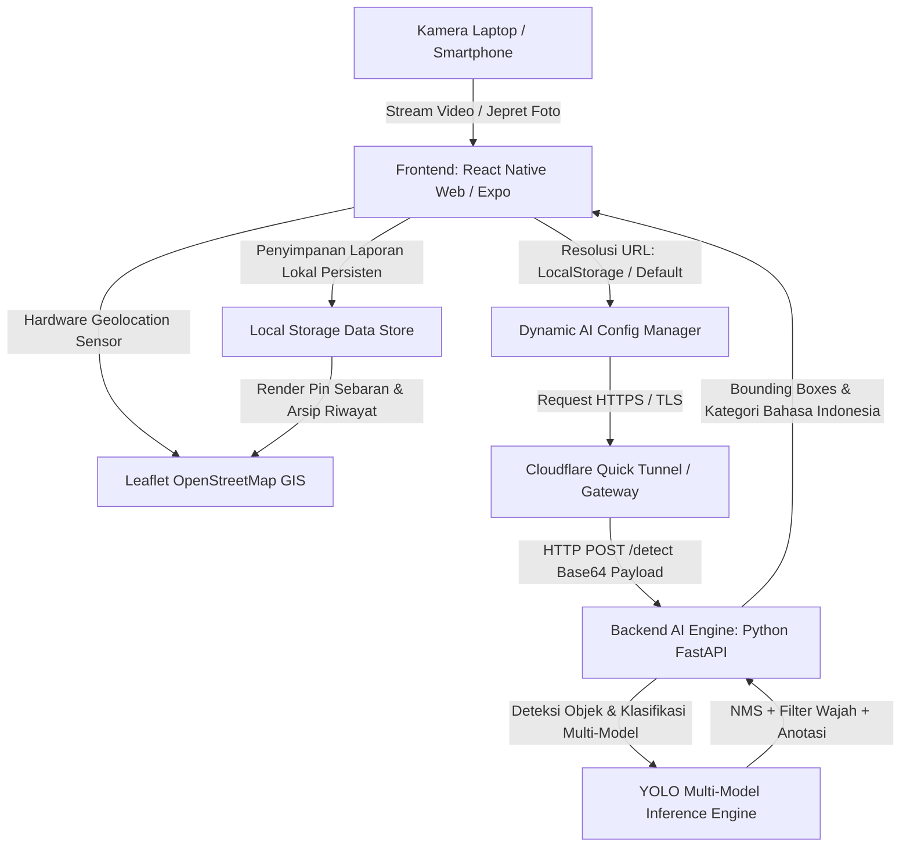

# 📘 Dokumentasi Arsitektur & Spesifikasi Sistem
## SpotBersih - Pantau Sampah, Bersihkan Bersama
### Arsitektur Teknis Terpadu (AI, GIS, Networking, & Frontend Web Engine)

---

## 1. Ringkasan Eksekutif
**SpotBersih** adalah platform web dan mobile pintar berbasis Artificial Intelligence (AI) dan Sistem Informasi Geografis (GIS) yang dirancang untuk mendeteksi, mengklasifikasikan, serta memetakan sebaran sampah liar secara *real-time*. Platform ini mengusung filosofi **"Warga Bantu Warga" (Civic Action)**, di mana masyarakat dapat bergotong royong melaporkan titik sampah dan menandai area yang telah dibersihkan guna menjaga kebersihan lingkungan bersama.

---

## 2. Diagram Arsitektur Sistem (*System Architecture*)



---

## 3. Komponen Arsitektur Utama

### A. Frontend Web & Mobile (React Native for Web + Expo)
1. **Split-Screen Dashboard Ergonomis**:
   - Layout 2 kolom responsif (*desktop/tablet*) dan bertumpuk mulus (*smartphone*) tanpa *scrolling* berlebih.
   - Sisi kiri didedikasikan untuk modul pemindai AI (**Live Cam AI Scanner** & **Jepret / Unggah Foto**).
   - Sisi kanan didedikasikan untuk **Peta Sebaran Sampah Interaktif** dan daftar **Laporan Aktif Warga**.
2. **Dynamic AI Server Configuration Engine (`app/src/config/aiServer.ts`)**:
   - Menyediakan resolusi URL cerdas dengan 4 tingkat prioritas:
     1. Kustom URL pengguna yang tersimpan di `localStorage` (`SPOTBERSIH_AI_SERVER_URL`).
     2. Deteksi otomatis `localhost` / `127.0.0.1` ke port `8000`.
     3. Variabel *environment* build (`EXPO_PUBLIC_AI_SERVER_URL`).
     4. Default HTTPS Quick Tunnel untuk GitHub Pages.
   - Memfasilitasi penggantian URL secara *on-the-fly* lewat antarmuka modal tanpa perlu *rebuild* kode.
3. **Arsitektur Aset In-Memory Base64**:
   - Semua logo, ikon kamera, dan ilustrasi di-render menggunakan konstanta *Base64 in-memory* di `app/src/constants/assets.ts`, mengeliminasi error *404 File Not Found* atau *image flicker*.
4. **Injeksi Font Vektor Tanpa Request Jaringan**:
   - Font icon `Ionicons.ttf` diinjeksi langsung dalam bentuk *Base64 `@font-face`* ke dalam `dist/index.html` via `fix_paths.py`, menjamin seluruh ikon muncul sempurna di semua browser tanpa kotak kosong (*rectangle fallback*).
5. **Anti-Cache Invalidation System**:
   - Skrip `fix_paths.py` menambahkan meta tag anti-cache (`Cache-Control: no-cache, no-store, must-revalidate`) dan parameter *query string* versi unik (`?v=<timestamp>`) pada seluruh bundel JavaScript untuk mencegah browser menyimpan cache basi.

---

### B. Lapisan Spasial & Sistem Informasi Geografis (GIS)
1. **Sensor GPS Hardware Murni (*Pure Hardware Geolocation*)**:
   - Menggunakan `navigator.geolocation.getCurrentPosition` langsung pada chip GPS perangkat tanpa perkiraan server internet (*zero IP guessing*).
   - Menjamin bahwa ketika GPS perangkat mati, sistem dengan jujur berstatus `🔴 GPS Belum Aktif`.
   - Ketika GPS dinyalakan dan diizinkan, koordinat langsung terkunci dengan akurasi meter.
2. **Pencarian Alamat Otomatis (*Reverse Geocoding*)**:
   - Koordinat `(latitude, longitude)` otomatis diterjemahkan ke nama jalan, kelurahan, dan kecamatan menggunakan **OpenStreetMap Nominatim API**.
3. **Penetapan Titik Interaktif (*Interactive Tap-to-Pin*)**:
   - Pengguna dapat mengetuk (*click/tap*) titik mana saja pada peta Leaflet untuk memindahkan atau menentukan pin lokasi sampah secara presisi.
4. **Reaktivitas Iframe Dinamis (*Dynamic Iframe Key*)**:
   - Elemen peta di-render di dalam `<iframe>` dengan *reactive key* (`key={userPos.lat-userPos.lng}`) sehingga peta langsung memusatkan pandangan (*viewport centering*) ke lokasi pengguna seketika koordinat GPS terkunci.

---

### C. Backend AI Inference Engine (FastAPI + YOLO Multi-Model)
1. **Multi-Model Object Detection**:
   - Memuat 3 arsitektur model YOLO:
     - Model 1: **Hrutik 8-Class Model** (`ml_models/hrutik_yolov8/best.pt`)
     - Model 2: **Roboflow 22-Class Model** (`ml_models/best.pt`)
     - Model 3: **Underwater Denoised 15-Class Model** (`ml_models/underwater_yolov8/best.pt`)
2. **Filter Wajah & Pencegahan False-Positive**:
   - Integrasi Haar Cascade Classifier untuk mendeteksi wajah/tubuh manusia dan mendiskualifikasi deteksi sampah yang tumpang tindih dengan manusia.
3. **Penerjemahan Kontekstual & 4 Kategori Pemilahan**:
   - Mengelompokkan setiap sampah ke dalam 4 kategori tempat sampah:
     - 🟡 **Daur Ulang (Recyclable)**
     - 🔘 **Residu (Non-Recyclable)**
     - 🟢 **Organik (Organic)**
     - 🔴 **B3 Berbahaya (Hazardous)**
4. **Validasi Wajib Deteksi**:
   - Tombol pengiriman laporan dikunci secara otomatis hingga AI mendeteksi minimal 1 objek sampah valid di dalam bingkai kamera.

---

### D. Jaringan & Konektivitas Global (Cloudflare Tunnel & Mixed Content Handling)
- **Zero Port-Forwarding**: Menggunakan **Cloudflare Quick Tunnel (`cloudflared.exe`)** yang menghubungkan server lokal FastAPI (port 8000) ke internet publik melalui enkripsi TLS/HTTPS.
- **Solusi Mixed-Content**: Memungkinkan klien web HTTPS (GitHub Pages) memanggil endpoint AI secara aman tanpa diblokir oleh browser.
- **Cross-Network Compatibility**: Smartphone yang terhubung ke jaringan seluler (4G/5G) dapat berkomunikasi langsung dengan backend AI di laptop pengguna.

---

## 4. Siklus Aksi Komunitas ("Warga Bantu Warga")

```
[1. 📸 Lapor Sampah] ──> Warga memindai dan mengirim laporan titik sampah ber-GPS.
          │
          ▼
[2. 🤝 Gotong Royong] ──> Warga sekitar melihat titik sampah pada peta dan membersihkannya bersama.
          │
          ▼
[3. 🧹 Hapus Laporan] ──> Warga menekan "Tandai Bersih & Hapus" untuk memperbarui peta secara real-time.
```

---

## 5. Ringkasan Endpoint API Backend

| Method | Endpoint | Deskripsi | Payload / Respon |
| :--- | :--- | :--- | :--- |
| `GET` | `/health` | Memeriksa status kesehatan server AI | `{"status": "online", "ready": true}` |
| `POST` | `/detect` | Mengirim gambar untuk inferensi deteksi sampah | **Req**: `{"image": "data:image/jpeg;base64,...", "confidence": 0.18}`<br>**Res**: `{"status": "success", "detections": [...], "detected_count": 2}` |

---

## 6. Prosedur Audit & Pengujian Mutu
1. **Type Safety**: Menjalankan `npm run typecheck` (`tsc --noEmit`) dengan standar nol toleransi error.
2. **Kompilasi Web**: Menjalankan `npx expo export --platform web && python fix_paths.py` untuk menghasilkan bundel produksi bersih di `dist/`.
3. **Penyajian Web**: Menjalankan `python -m http.server 3000 --directory app/dist` atau mengakses GitHub Pages `https://franswaas.github.io/spotbersih/`.
