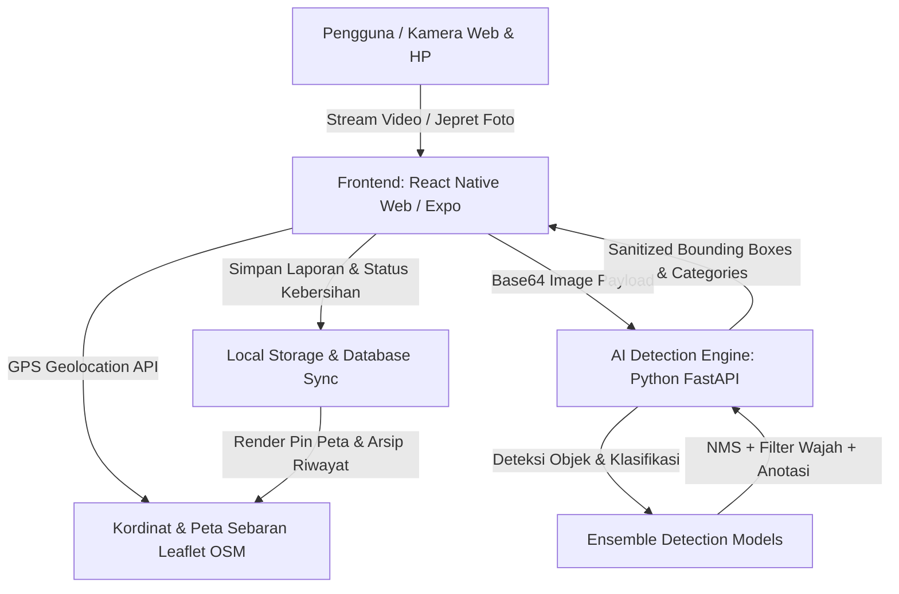

# 📘 Dokumentasi Arsitektur & Spesifikasi Sistem
## SpotBersih - Pantau Sampah, Bersihkan Bersama

---

## 1. Ringkasan Eksekutif
**SpotBersih** adalah platform web dan mobile pintar berbasis Artificial Intelligence (AI) dan Sistem Informasi Geografis (GIS) yang dirancang untuk mendeteksi, mengklasifikasikan, serta memetakan sebaran sampah liar secara *real-time*. Platform ini mengusung filosofi **"Warga Bantu Warga" (Civic Action)**, di mana masyarakat dapat bergotong royong melaporkan titik sampah dan menandai area yang telah dibersihkan guna menjaga kebersihan lingkungan bersama.

---

## 2. Arsitektur Sistem (*System Architecture*)



### Komponen Utama:
1. **Frontend Web & Mobile (React Native + Expo)**:
   - Antarmuka modern *split-screen dashboard* (tanpa *scrolling* berlebih).
   - Tampilan kamera responsif dengan *live laser scanner*, *real-time bounding box*, dan *direct webcam shutter*.
   - Manajemen riwayat pemindaian dan katalog edukasi pemilahan sampah.
   - Peta interaktif Leaflet OpenStreetMap dengan pin lokasi GPS pengguna dan titik sebaran sampah.

2. **AI Inference & Detection Engine (FastAPI + OpenCV)**:
   - Menerima gambar/frame kamera via HTTP POST `/detect`.
   - Menggabungkan hasil inferensi model deteksi objek dengan *Non-Maximum Suppression (NMS)*.
   - Dilengkapi *Face Filter* berbasis Haar Cascade untuk meminimalkan *false-positive* pada wajah/tubuh manusia.
   - Menerjemahkan kategori sampah ke dalam Bahasa Indonesia dan panduan pembuangannya.

3. **GIS & Spatial Mapping Layer (Leaflet OpenStreetMap)**:
   - Menampilkan koordinat GPS pengguna secara presisi dengan penanda animasi denyut biru (*pulsating user pin*).
   - Menampilkan pin sampah merah interaktif dengan *pop-up* foto bukti, alamat patokan, dan jumlah sampah.

4. **Siklus Aksi Komunitas ("Warga Bantu Warga")**:
   - **📸 Lapor**: Warga memindai dan mengirim laporan titik sampah di lingkungannya.
   - **🤝 Gotong Royong**: Warga sekitar melihat titik sampah pada peta dan membersihkannya bersama.
   - **🧹 Hapus Laporan**: Warga menandai lokasi *"Sudah Bersih"*, menghapus laporan dari sistem untuk efisiensi penyimpanan dan menjaga peta tetap aktual.

---

## 3. Alur Deteksi & Validasi Ketat AI

1. **Aktivasi Kamera**: Pengguna dapat memilih mode **Live Cam AI** (pemindaian langsung) atau **Jepret / Unggah Foto**.
2. **Ekstraksi Frame**: Frontend mengambil cuplikan resolusi optimal (640x360) dari elemen video.
3. **Inferensi AI**: Server memproses gambar, memfilter noise/wajah, dan mengembalikan data koordinat persentase `(x, y, width, height)`, tingkat keyakinan (*confidence*), serta kategori.
4. **Validasi Wajib Deteksi**: Tombol **"Laporkan Sampah"** dikunci (*disabled*) hingga AI berhasil mendeteksi minimal 1 objek sampah valid di dalam bingkai kamera.
5. **Anotasi Permanen**: Saat laporan dikirim, kotak deteksi dibakar (*burned-in*) ke dalam kanvas foto laporan agar riwayat dapat diaudit dengan jelas.

---

## 4. 4 Kategori Pemilahan & Panduan Tempat Sampah

| Kategori | Warna Tong | Jenis Sampah Contoh | Rekomendasi Penanganan |
| :--- | :--- | :--- | :--- |
| **Daur Ulang (Recyclable)** | 🟡 Kuning | Botol Plastik, Kardus, Kaleng, Kertas, Gelas Plastik | Bilas sisa kotoran, remas agar hemat ruang, salurkan ke Bank Sampah. |
| **Residu (Non-Recyclable)** | 🔘 Abu-Abu | Kantong Kresek, Styrofoam, Sachet Makanan, Puntung Rokok | Bungkus rapat dan buang ke tempat sampah residu menuju TPA. |
| **Organik (Organic)** | 🟢 Hijau | Sisa Makanan, Daun Kering, Kulit Buah, Sayuran | Olah menjadi pupuk kompos atau pakan maggot / ternak. |
| **B3 Berbahaya (Hazardous)**| 🔴 Merah | Baterai Bekas, Masker Medis, Bohlam, Limbah Elektronik | Pisahkan khusus dan serahkan ke *drop point e-waste* resmi. |

---

## 5. Keamanan & Sanitasi Sistem (*Security Hardening*)

- **Sanitasi Respon API**: Endpoint API backend hanya mengembalikan data publik bersih (`label`, `confidence`, `category`, `bounding boxes`). Tidak membocorkan path file server, nama arsitektur internal, atau struktur sistem.
- **Proteksi Git**: File bobot model (`*.pt`), `.env`, cache Python (`__pycache__`), dan folder build React Native/Expo diabaikan oleh `.gitignore`.
- **Privasi Pengguna**: Akses GPS hanya diminta dengan persetujuan eksplisit melalui dialog browser standar.

---

## 6. Panduan Menjalankan Sistem

### Prasyarat:
- Node.js (>= v18) & NPM
- Python 3.9 - 3.11
- Webcam / Kamera HP

### Langkah Menjalankan:
1. **Jalankan Backend AI Engine**:
   ```bash
   python yolo_api_server.py
   ```
   *(Server berjalan di `http://127.0.0.1:8000`)*

2. **Jalankan Frontend Web**:
   ```bash
   cd app
   npm run typecheck
   npx expo start --web --port 8081
   # atau sajikan build dist:
   # npx serve -l 3000 dist
   ```
   *(Buka browser di `http://localhost:3000`)*
